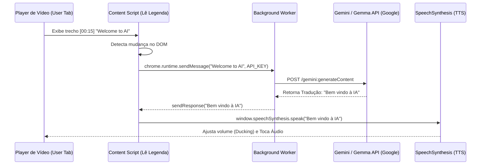

<div align="center">
  
  <h1>🎙️ DubAI</h1>
  <p><strong>Dublagem de Vídeo em Tempo Real Diretamente no Navegador</strong></p>

  <p>
    <a href="https://jcnok.github.io/DubAI/"></a>
    
    
    
    
    
  </p>
</div>

---

O **DubAI** é uma extensão inteligente e *open-source* para Google Chrome capaz de extrair legendas dinâmicas de plataformas de vídeo (YouTube, Udemy, Coursera, DeepLearning.ai, Anthropic) e gerar uma dublagem sintetizada hiper-realista em Português-BR. Tudo isso em tempo real, utilizando a API do Google ("Gemma 3" ou "Gemini Flash") e algoritmos avançados de sincronização de fala.

Seja para estudar tutoriais complexos ou acompanhar palestras internacionais, o DubAI quebra a barreira do idioma sem os custos proibitivos de plataformas fechadas.

## 📑 Índice
- [🌐 Acesso Rápido](#-acesso-rápido)
- [🌟 Principais Recursos](#-principais-recursos)
- [📦 Como Instalar (Modo Desenvolvedor)](#-como-instalar-modo-desenvolvedor)
- [⚙️ Como Usar na Prática](#%EF%B8%8F-como-usar-na-prática)
- [🗂️ Estrutura do Projeto](#-estrutura-do-projeto)
- [🧠 Arquitetura e Fluxo (Mermaid)](#-arquitetura-e-fluxo)
- [🛡️ Privacidade e Segurança](#%EF%B8%8F-privacidade-e-segurança)
- [🤝 Como Contribuir](#-como-contribuir)
- [📝 Licença](#-licença)
- [📫 Contato](#-contato)

---

## 🌐 Acesso Rápido
👉 **[Acesse o Site Oficial (GitHub Pages) do Projeto para Download da Extensão Pronta](https://jcnok.github.io/DubAI/)**


---

## 🌟 Principais Recursos

- **Tradução com IA Otimizada:** Envia blocos de texto contextuais para preservar precisão na tradução, suportando a nova família *Gemma 3* e a API padrão do *Gemini*.
- **Leitor Nativo (Zero Custo):** Permite dublagem de legendas já traduzidas pelas próprias plataformas, usando apenas a síntese de voz offline do sistema.
- **Detecção Avançada (Pre-Transcript):** Localiza e detecta transcrições completas da barra lateral em estruturas de LMS (ex: Coursera, DeepLearning.ai). Isso faz o carregamento prévio da tradução impedindo falhas de buffer em cursos técnicos acelerados.
- **Sincronização Dinâmica Inteligente:** A IA acelera matematicamente ou pausa momentaneamente o player do seu vídeo para garantir que a imagem não atropele a locução narrativa.
- **Audio Ducking Customizado:** O volume original do vídeo é reduzido automaticamente (*ducking*) enquanto o DubAI fala, e volta ao normal imediatamente nos silêncios.
- **Download de Transcrições:** Compile a transcrição inteira do vídeo do momento, gerando um `.txt` ideal para consultas com LLMs locais de estudo.

---

## 📦 Como Instalar (Modo Desenvolvedor)

A DubAI ainda não está listada na Chrome Web Store. Para utilizá-la gratuitamente, você deve fazer o download do pacote oficial:

1. **Baixe o pacote:** Acesse o [Site Oficial do projeto](https://jcnok.github.io/DubAI/), clique no botão azul **"Download Extensão (.zip)"**.
2. **Extraia os arquivos:** Extraia o conteúdo deste arquivo `.zip` para uma **pasta fixa** no seu computador (uma pasta que você não vá apagar depois).
3. **Abra as extensões:** Abra o Google Chrome e digite na barra de endereços: `chrome://extensions/`.
4. **Habilite permissões:** No canto superior direito, ative a chave **Modo do Desenvolvedor** (Developer mode).
5. **Carregue o pacote:** Clique no botão **Carregar sem compactação** (Load unpacked) no canto superior esquerdo.
6. **Selecione a pasta:** Escolha a pasta raiz onde você acabou de extrair os arquivos (a pasta que contém o arquivo `manifest.json`).
7. **Pronto:** O ícone do DubAI aparecerá na sua barra de extensões superior. Fixe-o no painel para acesso rápido.

**🚨 Segurança Crítica:** Imediatamente após a instalação, acesse a página de qualquer vídeo online e **atualize a página (pressione F5)**. Isso é necessário para inicializar a barreira de comunicação do Google Chrome (`Service Worker Messaging`) de forma orgânica.

---

## ⚙️ Como Usar na Prática

1. **Configuração da API:** Clique no ícone 🎙️ na barra do navegador. Altere o "Modo de Operação" para **Tradutor IA**. Informe a sua [Google AI Studio API Key](https://aistudio.google.com/app/apikey) (é seguro, fica no armazenamento local Chrome).
2. **Ative a Legenda no Vídeo:** Acesse o player (YouTube, Udemy, etc.) e ative a opção **CC (Closed Captions) / Legendas do Áudio Original**. O DubAI *lê as engrenagens da web*, então precisa que a legenda esteja aparecendo (mesmo que você depois a oculte via CSS, o elemento deve existir no DOM).
3. **Inicie a Magia:** Clique em **Iniciar Dublagem** na janela da extensão. 
4. **Personalize a Fala:** Ajuste *Tradução*, *Tom de Voz* e escolha uma *Voz Masculina/Feminina* baseada no catálogo do seu Sistema Operacional.

---

## 🗂️ Estrutura do Projeto

O código do DubAI segue as boas práticas do Manifest V3 do Google, separando as lógicas de forma limpa:

```text
├── manifest.json       # O "coração" da extensão. Define permissões (activeTab, storage) e os scripts
├── popup.html          # Interface do usuário (janela que abre ao clicar no ícone)
├── popup.js            # Lógica que controla a UI da extensão, botões, e salva preferências
├── popup.css           # Estilos e design Minimalista (Aparência, cores, botões)
├── content.js          # Injetado na página do vídeo. Fica "escutando" as legendas no DOM e falando (TTS)
├── background.js       # Service Worker de fundo. Lida isoladamente com requisições HTTPS para a API do Gemini
├── README.md           # A documentação que você está lendo agora.
├── CONTRIBUTING.md     # Guia de passos de como a comunidade pode ajudar a evoluir o app
└── LICENSE             # Licença open-source MIT
```

---

## 🧠 Arquitetura e Fluxo

Para que não tenhamos vazamento de API KEYs no *DOM / front-end* dos sites, adotamos a seguinte arquitetura de mensagens:



---

## 🛡️ Privacidade e Segurança

Seus dados permanecem apenas na sua máquina.

1. **Local Storage First:** Suas chaves de API, preferências de velocidade e modo são salvos via `chrome.storage.local`. Nenhum dado sobe para os nossos servidores (porque não temos nenhum!).
2. **Agnóstico a Infraestrutura:** As chamadas à inteligência do modelo do Google são feitas isoladamente no Service Worker (`background.js`). Isso blinda a extensão de *Cross-Site Scripting* em players potencialmente modificados de terceiros.
3. **Leitura Pura do DOM:** Sem injeções ou scripts mirabolantes de engenharia reversa. Se a legenda está rolando no site, nós lemos a camada exterior e processamos suavemente sem prejudicar a reprodução (DRM ou cache protegido).

---

## 🤝 Como Contribuir

O DubAI é feito pela comunidade para a comunidade. Se você achou um bug no sincronismo, quer ajudar a melhorar as RegExp lógicas de texto do Coursera/YouTube ou apenas melhorar algo visual, veja o nosso **[Guia de Contribuição](CONTRIBUTING.md)**.

⭐ **Gostou do projeto? Considere dar uma estrela neste repositório! É o maior incentivo que a comunidade open-source pode receber.** ⭐

---

## 📝 Licença
Distribuído sob a licença **MIT**. Você pode baixar, modificar, recriar a arquitetura e rentabilizar de forma livre. Veja o arquivo de [Licença (LICENSE)](LICENSE) para obter todos os detalhes da permissão.

---

## 📫 Contato
### **Júlio Okuda**

- 📧 **E-mail:** [julio.okuda@gmail.com](mailto:julio.okuda@gmail.com)
- 💡 Participe da discussão, abra issues e mande PRs e torne a educação baseada em vídeos mais acessível globalmente.

<div align="center">
  <p>Feito com paixão à educação e Inteligência Artificial. ❤️</p>
</div>
